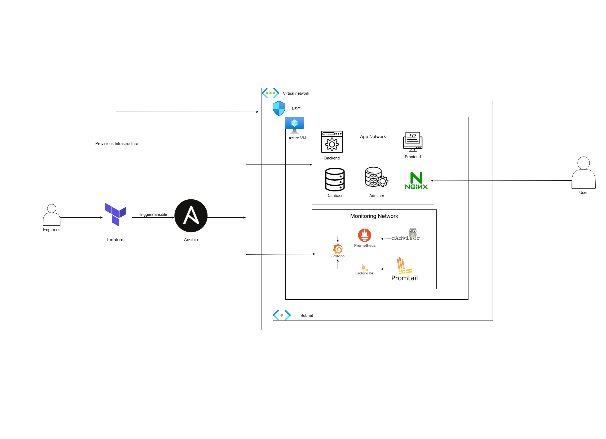

## Full Stack Monitoring & Automation Platform

This project is a fully automated, production-ready stack for deploying, monitoring, and managing a modern web application on Azure. It leverages Terraform for infrastructure provisioning, Ansible for configuration management and application deployment, and Docker Compose for orchestrating application and monitoring services. The stack includes a PostgreSQL database, backend and frontend services, Nginx reverse proxy, SSL via Certbot, and a complete monitoring suite (Prometheus, Grafana, Loki, Promtail, cAdvisor).

---

## Table of Contents

- [Architecture Overview](#architecture-overview)
- [Folder Structure](#folder-structure)
- [Infrastructure Provisioning (Terraform)](#infrastructure-provisioning-terraform)
- [Configuration Management & Deployment (Ansible)](#configuration-management--deployment-ansible)
- [Application & Monitoring Stack (Docker Compose)](#application-Monitoring)
- [How to Deploy](#how-to-deploy)
- [Accessing the Services](#accessing-the-services)
- [Future Improvements](#future-improvements)


## Architecture Overview



All infrastructure and services are provisioned and configured with a single command:
```
terraform apply -auto-approve
```

## Folder Structure

```
.
├── ansible/
│   ├── .env.j2
│   ├── ansible.cfg
|   ├── group_vars
|   |    └── all.yaml 
│   ├── compose.monitoring.yaml.j2
│   ├── compose.yaml.j2
│   ├── inventory.ini
│   ├── nginx.conf.j2
│   ├── playbook.yaml
│   └── sample_all.yaml  # example file for the all.yaml file within group_vars
├── monitoring/
│   ├── grafana.ini
│   ├── loki-config.yaml
│   ├── prometheus.yaml
│   ├── promtail-config.yaml
│   ├── dashboards/
│   │   ├── prometheus-dashboard.json
│   │   └── cadvisor-dashboard.json
│   └── provisioning/
│       ├── datasources/
│       │   └── datasources.yaml
│       └── dashboards/
│           └── dashboard.yaml
├── terraform/
│   ├── ansible.tf
│   ├── backend.tf
│   ├── main.tf
│   ├── ouptut.tf
│   ├── providers.tf
│   ├── terraform_sample.tfvars  # sample file for terraform.tfvars
│   └── variables.tf
└── .gitignore
```

---

## Infrastructure Provisioning (Terraform)

All Azure infrastructure is defined using **Terraform** with the `azurerm` provider.

### 🔑 Key Resources

- **Resource Group**, **Virtual Network**, **Subnet**
- **Public IP**, **Network Interface**, **Network Security Group**
- **Linux Virtual Machine** (Ubuntu 22.04 LTS)
- **Network Security Rules** for:
  - SSH (port 22)
  - HTTP (port 80)
  - HTTPS (port 443)
- **Remote and Local Provisioners** for:
  - Ansible playbook execution.
  - Dynamic DNS update - using [afraid.org](https://freedns.afraid.org/).

> 🌐 Update the domain in `ansible.tf` with your own [afraid.org](https://freedns.afraid.org/) credentials. Azure DNS was not used in this setup.

### 📦 Variables

- Defined in [`variables.tf`](terraform/variables.tf)
- Values provided via:
  - [`terraform_sample.tfvars`](terraform/terraform_sample.tf) (example file), actual file is `terraform.tfvars`

### 🗃️ Remote State

- Configured in [`backend.tf`](terraform/backend.tf).
- Uses **Azure Storage Account** for remote state management.
- You must create your own storage account and container, then update the values in `backend.tf`.

---

## Configuration Management & Deployment (Ansible)

After the VM is provisioned, Ansible is used to:

- Install Docker, Docker Compose, and Certbot
- Set up SSL certificates (via Certbot)
- Create required directories and networks
- Render and copy environment and configuration files
- Deploy the application and monitoring stack using Docker Compose

> 🔐 You must manually create a `group_vars` directory to store environment variables for each host. This folder is excluded from version control for security reasons.

> 🛠️ You must also update the [`nginx.conf.j2`](ansible/nginx.conf.j2) file and the grafana environment variable at [`compose.monitoring.yaml.j2`](ansible/compose.monitoring.yaml.j2) with your actual domain and the SSL certificate paths issued by Certbot.

See [`playbook.yaml`](ansible/playbook.yaml) for the full automation logic.

---

## Application & Monitoring Stack (Docker Compose)
The application and monitoring services are defined in two Compose files:

- [`compose.yaml.j2`](ansible/compose.yaml.j2): Main app stack (db, adminer, backend, frontend, nginx, certbot)
- [`compose.monitoring.yaml.j2`](ansible/compose.monitoring.yaml.j2): Monitoring stack (prometheus, grafana, loki, promtail, cadvisor)
These are rendered and deployed to `/opt/monitoring_app/` on the VM.

### Networks & Volumes

Networks: frontend_network, backend_network, monitoring_network
Volumes: For persistent data (Postgres, Grafana, Loki, Prometheus, etc.)

### Monitoring Stack Details

Prometheus
- Config: [`prometheus.yaml`](monitoring/prometheus.yaml)
- Dashboards: prometheus-dashboard.json
- Data Source: Exposed to Grafana

Grafana
- Config: [`grafana.ini`](monitoring/grafana.ini)
- Provisioning: Dashboards and datasources auto-provisioned from provisioning
- Dashboards: Mounted from dashboards

Loki & Promtail
- Loki Config: [`loki-config.yaml`](monitoring/loki-config.yaml)
- Promtail Config: [`promtail-config.yaml`](monitoring/promtail-config.yaml)
- Logs: Promtail scrapes Docker and system logs, ships to Loki

cAdvisor
- Container Metrics: Exposed to Prometheus and Grafana
- Dashboard: [`cadvisor-dashboard.json`](monitoring/dashboards/cadvisor-dashboard.json)

---

## How to Deploy

### 1. Prerequisites
- [Terraform](https://www.terraform.io/)
- [Ansible](https://www.ansible.com/)
- Azure CLI
- A registered domain  on [afraid.org](https://freedns.afraid.org/)(It is free).

### 2. Configure Variables
Edit `terraform.tfvars` or copy and modify `terraform_sample.tfvars` with your values.

### 3. Initialize Terraform
```bash
cd terraform
terraform init
```

### 4. Apply Terraform 
```
terraform apply -auto-approve
```
This will:

- Provision all Azure resources
- Configure DNS (if credentials provided)
- Run Ansible to install Docker, Certbot, and deploy the stack
- Start all application and monitoring containers

---

## Accessing the Services

- Frontend: `https://<your-domain-or-public-ip>/`
- Backend API: `https://<your-domain-or-public-ip>/api`
- Backend docs: `https://<your-domain-or-public-ip>/docs`
- Grafana: `https://<your-domain-or-public-ip>/grafana`
- Prometheus: `https://<your-domain-or-public-ip>/prometheus`
- adminer: `https://db.<your-domain-or-public-ip>/`

---
## Future Improvements

To make this setup more user-friendly and production-ready, I plan to implement the following enhancements:

- Add a `bootstrap.sh` script to automate:
  - Copying sample files
  - Inserting basic configuration values
  - Setting up required directory structures

- Replace:
  - The dynamic DNS setup via [afraid.org](https://freedns.afraid.org/) with Azure DNS for native integration
  - Manual edits in the `nginx.conf` file with templated variables rendered dynamically by Ansible
