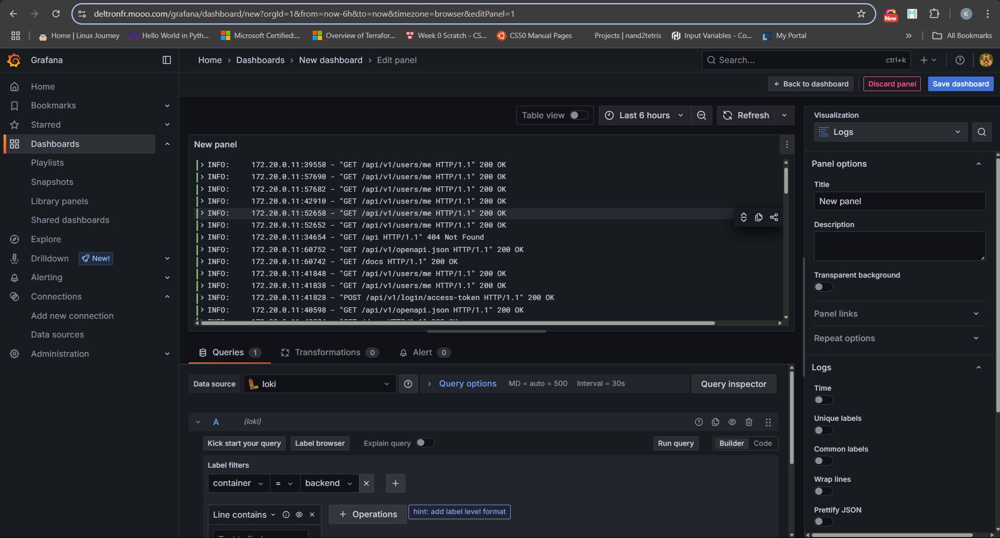

# Full-Stack Deployment with Monitoring and Logging - DevOps November CV Challenge

This project provides a robust template for deploying a full-stack application with integrated monitoring and logging using Docker Compose. The stack includes a PostgreSQL database, Adminer for database management, Nginx Proxy Manager for reverse proxying, and a comprehensive monitoring suite (Prometheus, Grafana, cAdvisor, Loki, etc.). The backend and frontend applications are containerized alongside these services and deployed to a cloud platform, showcasing end-to-end DevOps skills. The project serves as a demo application for the DevOps November Resume Challenge, where participants will deploy a full-stack application with a FastAPI backend and ReactJS frontend using ChakraUI.

---

## Table of Contents

- [Project Structure](#project-structure)
- [Environment Configuration](#environment-configuration)
- [Docker Compose Overview](#docker-compose-overview)
- [Service Details](#service-details)
  - [Database (Postgres)](#database-postgres)
  - [Adminer](#adminer)
  - [Backend](#backend)
  - [Frontend](#frontend)
  - [Nginx Proxy Manager](#nginx-proxy-manager)
  - [Monitoring Stack](#monitoring-stack)
- [How to Deploy](#how-to-deploy)
- [Accessing Services](#accessing-services)
- [Monitoring and Logging](#monitoring-and-logging)
- [License](#license)

---

## Project Structure

```
.
├── .env                  # Root environment variables
├── .env.sample           # Sample root environment file
├── compose.app.yaml      # Main Docker Compose file
├── compose.monitoring.yaml # Monitoring stack Compose file
├── backend/
│   ├── .env.sample       # Backend environment sample
│   └── Dockerfile        # Backend Dockerfile
├── frontend/
│   ├── .env.sample       # Frontend environment sample
│   └── Dockerfile        # Frontend Dockerfile
├── monitoring/
│   ├── grafana.ini
│   ├── loki-config.yaml
│   ├── prometheus.yaml
|   └── promtail-config.yaml
├── nginx/
│   └── nginx.conf               # (Optional) Custom Nginx configs
└── ...
```


---

## Environment Configuration

Before deploying, configure your environment variables:

- Copy `.env.sample` to `.env` in the root, `backend/`, and `frontend/` directories.
- Fill in the required values, especially sensitive data like `POSTGRES_PASSWORD`.

## Docker Compose Overview

The main orchestration files are [`compose.app.yaml`](compose.app.yaml) and [`compose.monitoring.yaml`](compose.monitoring.yaml), which includes:

- Database (Postgres)
- Adminer (DB UI)
- Backend (custom app)
- Frontend (custom app)
- Nginx Proxy Manager (reverse proxy)
- Monitoring stack (via `compose.monitoring.yaml`)

All services are connected via Docker networks for secure, isolated communication.

---

## Service Details

#### Database (Postgres)

- **Image:** `postgres:13`
- **Environment:** Set via `.env` (`POSTGRES_PASSWORD`, `POSTGRES_USER`, `POSTGRES_DB`)
- **Persistence:** Data stored in the `postgres_vol` Docker volume
- **Healthcheck:** Ensures DB is ready before dependent services start

#### Adminer

- **Image:** `adminer`
- **Port:** `8080`
- **Purpose:** Web-based database management UI for Postgres

#### Backend

- **Build Context:** `./backend`
- **Dockerfile:** `backend/Dockerfile`
- **Environment:** Loaded from `backend/.env`
- **Port:** `8000`

#### Frontend

- **Build Context:** `./frontend`
- **Dockerfile:** `frontend/Dockerfile`
- **Environment:** Loaded from `frontend/.env`
- **Port:** `5173`

#### Nginx Proxy Manager

- **Image:** `jc21/nginx-proxy-manager:latest`
- **Ports:** `80` (HTTP), `81` (Admin UI), `443` (HTTPS)
- **Volumes:** 
  - `data` for Nginx data
  - `letsencrypt` for SSL certificates
- **Purpose:** Reverse proxy for frontend, backend, and monitoring UIs

#### Monitoring Stack

Defined in [`compose.monitoring.yaml`](compose.monitoring.yaml):

- **Prometheus:** Metrics collection
- **Grafana:** Metrics and Logs visualization
- **cAdvisor:** Container resource monitoring
- **Loki:** Log aggregation

Configuration files are in the `monitoring/` directory.

---

## How to Deploy

1. **Clone the repository and navigate to the root directory.**

2. **Set up environment files:**
   - Copy `.env.sample` to `.env` in the root, `backend/`, and `frontend/`.
   - Edit `.env` files with your configuration.

3. **Choose your deployment environment**

    You can deploy the stack either **locally** or on a **cloud VM** (recommended for production). Depending on your choice, environment-specific configuration changes are required:

#### • Local deployment (for testing/development):

- Use the `.env` files as provided, or simply:
- Remove any **Grafana subpath** settings from your `.env` files  
    (e.g. `GF_SERVER_SERVE_FROM_SUB_PATH`).
- If Prometheus isnt configured behind a reverse proxy, consider removing or adjusting the `web.external-url` setting in its config.  
    > _Note: This is optional unless Prometheus is failing to serve correctly due to the proxy settings._

#### • Cloud VM deployment (with a registered domain):

- This is required for production and public access.
- In all `.env` files, update references of `localhost`, `backend`, `frontend`, etc., to match your **registered domain** (e.g. `https://yourdomain.com`).
- This ensures correct CORS, proxy routing, and dashboard URLs.
- Examples of fields that need updating:
    - `BACKEND_CORS_ORIGINS`
    - `VITE_API_URL`
    - `GF_SERVER_ROOT_URL`

4. **Build and start all services:**
   ```sh
   docker compose -f compose.app.yaml -f compose.monitoring.yaml up -d
    ```
    > _Note: The default logins for NPM are:_
    ```
    email: admin@example.com
    password: changeme
    ```

    _You can use Nginx Proxy Manager (NPM) to easily set up SSL certificates for your domain and subdomains. Alternatively, you can use your own custom Nginx configuration (an example config is provided), which also includes routing non-www requests to their www equivalent. But you would have to get the necessary certificates from letsencrypt._


### Using the config file
- uncomment `#- ./nginx/nginx.conf:/data/nginx/custom/http_top.conf` in the compose.yml file. This maps nginx.conf file on NPM.
- restart the application
    ```
    docker compose -f compose.app.yaml -f compose.monitoring.yaml up --force-recreate

---

## Accessing Services

| Service                | URL/Port                | Notes                                      |
|------------------------|-------------------------|--------------------------------------------|
| Frontend               | https://deltronfr.com   | React app                                  |
| Backend API            | https://deltronfr.com/api  | FastAPI app                                |
|Backend API docs   | https://deltronfr.com/docs    | API docs   |
|Backend API redoc   | https://deltronfr.com/redoc    | FastAPI Backend Redoc  |
| Adminer (DB UI)        | https://db.deltronfr.com   | Login with Postgres creds                  |
| Nginx Proxy Manager UI | https://nginx.deltronfr.com     | Set up your hosts|
| Grafana                | https://deltronfr.com/grafana   | Use the login in the `.env` file              |
| Prometheus             | https://deltronfr.com/prometheus  | Metrics explorer                           |

<table>
  <tr>
    <td></td>
    <td></td>
  </tr>
  <tr>
    <td></td>
    <td></td>
  </tr>
</table>

---

## Monitoring and Logging
- After all applications are successfully accessible through the custom domain, grafana is then configured for visualizations of metric and logs.
- Login to grafana using your credentials.
- Set prometheus as a data source with the URL `http://prometheus:9090/prometheus`
- Set loki as a data source with the URL `http://loki:3100`
- Import container metrics dashboard using ID `19268`
- View logs in grafana collected by loki:
- Go to your **Grafana dashboard**.
  - Click **"Create" → "Dashboard" → "Add visualization"**.
  - In the new panel:
    - Set the **data source** to `Loki`.
    - Change the **visualization type** to **Logs**.
    - In the **Query field**, type:
      ```logql
      {container="your-container-name"}
      ```
      Replace `your-container-name` with the actual name of the container you want to view logs for.
      _You could also use the label filters option in the `Queries` tab._
    - Click **"Run Query"** to load the logs.
    - (Optional) Save the panel to your dashboard for quick access later.


<table>
  <tr>
    <td></td>
    <td></td>
  </tr>
  <tr>
    <td colspan="2" align="center"></td>
  </tr>
</table>


---

## License

See [LICENSE](LICENSE) for details.